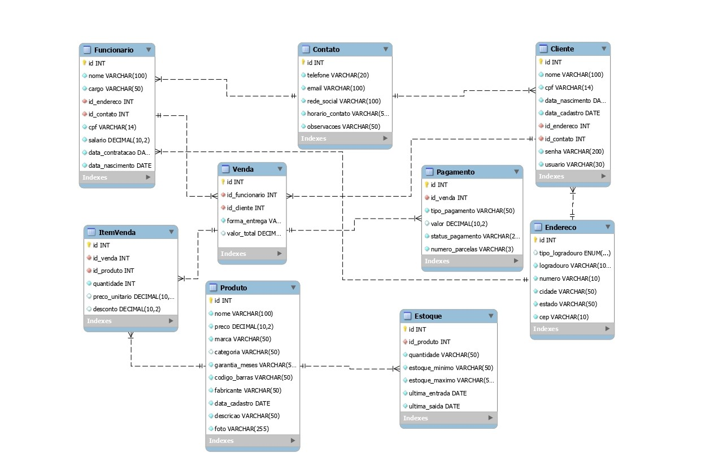

# 🛠️ Projeto Backend Tec
Projeto integrador desenvolvido no Senac Tatuapé, com foco no Back-End de um sistema para uma loja de eletrodomésticos e equipamentos de informática. Idealizado para representar a estrutura funcional de um comércio moderno

# Descrição do Diagrama do Banco de Dados
O banco de dados do Projeto Tec foi modelado para controlar as principais operações de uma loja, com foco em:

* Clientes

* Funcionários

* Produtos

* Vendas

* Pagamentos

* Estoque

# 🔎 Principais Entidades e Relacionamentos

* Cliente e Funcionário:

Relacionados às tabelas de Endereço e Contato, garantindo a centralização e reutilização de informações pessoais e de comunicação.

* Produto:

Traz informações detalhadas como nome, preço, marca, categoria, código de barras, fabricante, garantia e descrição.

* Estoque:

Controla as quantidades de cada item, com dados como estoque mínimo, máximo, data da última entrada e saída.

* Venda:

Registra as transações comerciais, vinculando clientes e funcionários responsáveis. Também armazena dados de entrega e valor total.

* ItemVenda:

Detalha os produtos incluídos em cada venda, com quantidade, preço unitário e possíveis descontos.

* Pagamento:

Relacionado diretamente à venda, contendo tipo de pagamento, valor, status e número de parcelas.

# Integridade Referencial
As chaves estrangeiras garantem a integridade entre as tabelas, tornando o sistema relacional coeso, seguro e eficiente, tanto para o uso operacional quanto para a geração de relatórios e análises administrativas.

# Diagrama do Banco de Dados

## Back-End

A parte do back-end conta com a implementação do banco de dados MySQL, responsável pelo armazenamento e gerenciamento dos dados da aplicação.

## Ambiente de Desenvolvimento

O back-end foi desenvolvido utilizando o **Visual Studio Code**:

# Autores
* Allan Victor – Front-End

* Fernanda Batista – Back-End, Front-End e Banco de Dados

* Ryan – Front-End

* Thiago Sanches – Back-End, Front-End, Banco de Dados e Documentação
